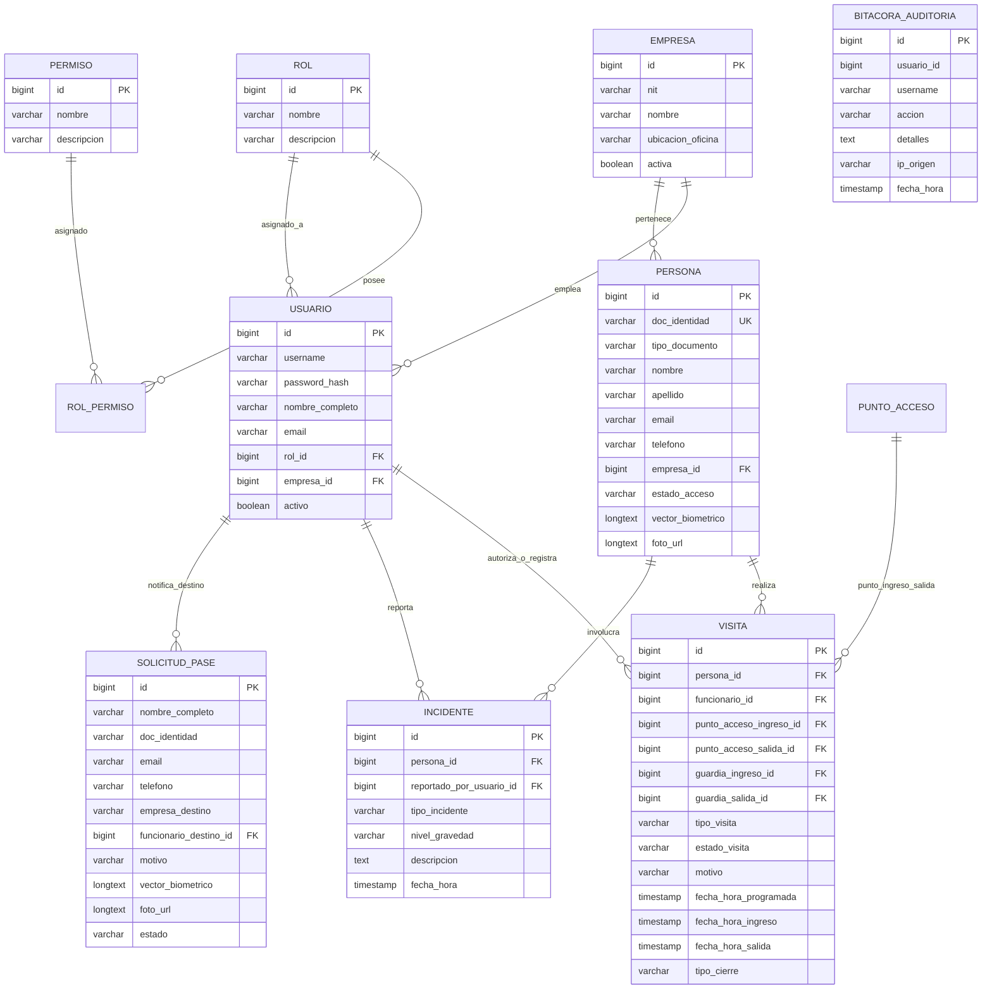

<div align="center">

# SICA — Sistema Integrado de Control de Acceso
### *Complejo Empresarial "Zona Acme"*

[](https://www.oracle.com/java/)
[](#3-biometría-facial-e-inteligencia-de-acceso-128d-ia)
[](https://google.github.io/mediapipe/)
[](#3-biometría-facial-e-inteligencia-de-acceso-128d-ia)
[](https://developer.mozilla.org/es/docs/Web/HTML)
[](https://developer.mozilla.org/es/docs/Web/CSS)
[](https://developer.mozilla.org/es/docs/Web/JavaScript)
[](https://docs.oracle.com/javase/tutorial/uiswing/)
[](https://www.mysql.com/)
[](https://jwt.io/)
[](https://www.formdev.com/flatlaf/)
[](https://github.com/DMntill4/SICA.git)

<p align="center">
  <b>Sistema de arquitectura hexagonal pura + Reconocimiento Biométrico Facial impulsado por Inteligencia Artificial (IA & Computer Vision 128D) en vivo + Portal Web de Autoservicio de Visitantes (HTML5, CSS3, JavaScript) y cliente GUI de escritorio en Java Swing (FlatLaf Dark) para el control de accesos, incidentes y auditoría inmutable en tiempo real.</b>
</p>

</div>

---

## Tabla de Contenidos

- [1. Introducción y Contexto del Problema](#1-introducción-y-contexto-del-problema)
- [2. Características Principales y Novedades](#2-características-principales-y-novedades)
- [3. Biometría Facial e Inteligencia de Acceso (128D - IA)](#3-biometría-facial-e-inteligencia-de-acceso-128d-ia)
- [4. Diagrama Entidad-Relación (ER Diagram)](#4-diagrama-entidad-relación-er-diagram)
- [5. Stack Tecnológico](#5-stack-tecnológico)
- [6. Arquitectura Hexagonal, Principios SOLID y Patrones de Diseño](#6-arquitectura-hexagonal-principios-solid-y-patrones-de-diseño)
- [7. Control de Acceso Basado en Roles (RBAC)](#7-control-de-acceso-basado-en-roles-rbac)
- [8. Guía de Instalación y Ejecución](#8-guía-de-instalación-y-ejecución)
- [9. Catálogo de Endpoints REST API](#9-catálogo-de-endpoints-rest-api)
- [10. Pruebas Unitarias y Cobertura QA (Suite 100%)](#10-pruebas-unitarias-y-cobertura-qa-suite-100)
- [11. Recomendaciones de Despliegue y Seguridad](#11-recomendaciones-de-despliegue-y-seguridad)
- [12. Contribuidores y Autores](#12-contribuidores-y-autores)

---

## 1. Introducción y Contexto del Problema

El Complejo Empresarial **"Zona Acme"** alberga a más de 30 empresas de alto perfil. Sin embargo, su control de acceso manual basado en cuadernos de papel y comunicación por radio generaba cuellos de botella, falta de trazabilidad e imprecisión en emergencias.

**SICA** resuelve estas problemáticas mediante:
- **Reconocimiento Biométrico Facial mediante Inteligencia Artificial (IA)**: Redes neuronales de visión computacional que capturan 468 landmarks faciales y sintetizan una firma vectorial 128D para autenticación por cámara en vivo en 5 segundos ($\text{Dist} \le 0.35$).
- **Portal Web de Autoservicio (`/portal`)**: Desarrollado en HTML5, Vanilla CSS3 y JavaScript ES6+ para registro independiente de invitados, emisión de pases web y Hub de Usuario Frecuente.
- **Gestión Avanzada de Fotografías**: Carga directa de imágenes locales desde archivos de PC (formato Base64), sincronización de fotografías capturadas vía webcam desde la web y avatares vectoriales 2D de alta definición.
- **Automatización de los 4 Flujos de Acceso**: Pre-Registrado (`VIS`), No Anunciado (`WALKIN-01`), Pase Temporal por Olvido (`FORGET-01`) y Regularización Automática de Salida Olvidada (`REG-01` a `REG-07`).
- **Seguridad Reactiva e Inmediata**: Bloqueo instantáneo en portería al registrar incidentes de gravedad CRÍTICO o ALTO (`RESTRINGIDO`).
- **Auditoría Inmutable**: Registro append-only de todas las operaciones del sistema con IP de origen y contexto de usuario.

---

## 2. Características Principales y Novedades

| Módulo | Descripción |
|---|---|
| **Gestión de Fotos & Avatares** | Carga de fotos locales desde la PC (`📁 Seleccionar Foto de PC`), sincronización automática de capturas webcam web y siluetas vectoriales 2D personalizadas. |
| **Edición Completa de Personas** | Diálogo modal `✏️ Editar Persona` con actualización de avatares en tiempo real, validaciones in-situ y trazabilidad de auditoría. |
| **Modal WALKIN-01 (No Anunciado)** | Formulario interactivo para captura de datos de visitantes sin cita previa, autocompletado por documento y selección del funcionario/anfitrión a notificar. |
| **Modal FORGET-01 (Carnet Olvidado)** | Registro de pases temporales por olvido de documento físico con estado `PENDIENTE_APROBACION_OLVIDO` y vigencia puntual de 1 día. |
| **Reconocimiento Facial IA 128D** | Escaneo en vivo con redes neuronales MediaPipe Face Mesh, cálculo vectorial de distancia euclidiana y verificación anti-duplicados por rostro. |
| **Portal Web de Autoservicio** | Interfaz web responsiva (`/portal`) con Hub de Usuario Frecuente (`ESTADO: HABILITADO` / `ESTADO: RESTRINGIDO`), solicitud y cancelación de pases. |
| **Autenticación & JWT** | Login con hashing `BCrypt` y tokens JWT de sesión sin estado con revocación en logout (`token_revocado`). |
| **RBAC Granular** | Control de acceso basado en 16 permisos individuales en BD (`crear_persona`, `checkin_visita`, `aprobar_visita`, etc.). |
| **Regularización de Salidas Olvidadas** | Auto-cierre de visitas previas activas en estado `CERRADA_POR_SISTEMA` al ingresar nuevamente, garantizando flujo continuo sin bloqueos. |
| **Interfaz Swing FlatLaf Dark** | UI de escritorio moderna estructurada por roles (`GuardiaPanel`, `FuncionarioPanel`, `IncidentesPanel`, `AuditoriaPanel`, `ReportesPanel`). |

---

## 3. Biometría Facial e Inteligencia de Acceso (128D - IA)

El sistema integra **Inteligencia Artificial (IA) y Visión Computacional** de alta precisión para el reconocimiento de personas mediante la extracción de vectores biométricos multidimensionales (128D):

- **Redes Neuronales de Visión (IA)**: Inferencia en tiempo real utilizando modelos de redes neuronales convolucionales (MediaPipe AI Neural Vision) que rastrean 468 puntos de referencia faciales de la persona frente a la cámara.
- **Verificación Vectorial**: Comparación euclidiana entre la firma facial escaneada por la IA y la base de datos de personas.
  $$\text{Distancia Euclidiana} = \sqrt{\sum_{i=1}^{128} (v_{1,i} - v_{2,i})^2} \le 0.35 \implies \text{Similitud} \ge 85\%$$
- **Malla Facial 3D Snug-Fit**: Ajuste anatómico proporcional de la visualización wireframe de la IA sobre el rostro del visitante.
- **Ruta A (Usuario Frecuente)**: Reconocimiento directo por cámara e IA en 5 segundos con acceso al Hub de Usuario Frecuente.
- **Ruta B (Nuevo Registro)**: Verificación preventiva contra documentos y vectores preexistentes antes de autorizar un nuevo perfil.

---

## 4. Diagrama Entidad-Relación (ER Diagram)

El siguiente diagrama en **Mermaid** detalla el esquema relacional de la base de datos MySQL / H2 implementado en [schema.sql](file:///c:/Users/dalej/OneDrive/Desktop/SICA/src/main/resources/schema.sql):



---

## 5. Stack Tecnológico

<div align="center">

| Tecnología | Rol en la Aplicación |
|---|---|
| **Java 21 (OpenJDK)** | Lenguaje principal de programación con sintaxis moderna (Records, Pattern Matching). |
| **Inteligencia Artificial (IA) & Computer Vision** | Modelos neuronales de visión computacional para biometría facial de 128 dimensiones. |
| **MediaPipe Neural AI Vision** | Extracción biométrica facial con IA de 468 puntos de referencia en el navegador. |
| **HTML5 / CSS3 / JavaScript (ES6+)** | Frontend del Portal Web de Autoservicio (`/portal`), modales custom Glassmorphism y dinámicas SPA de la cámara. |
| **Java Swing + FlatLaf 3.4** | Cliente GUI de escritorio con diseño oscuro (*Dark Theme*) libre de recortes. |
| **JDK Native HttpServer** | Servidor web concurrente integrado (`com.sun.net.httpserver.HttpServer`). |
| **MySQL 8.0 & H2 Database** | Motores de base de datos relacional (Persistencia JDBC nativa sin ORM/JPA). |
| **Jackson Databind** | Parseo y serialización JSON de alta velocidad. |
| **Auth0 java-jwt & jBCrypt** | Seguridad, hashing seguro de contraseñas de un solo sentido y firmas JWT. |
| **Apache Maven** | Gestión de dependencias y empaquetado JAR ejecutable autocontenido (*Shaded JAR*). |

</div>

---

## 6. Arquitectura Hexagonal, Principios SOLID y Patrones de Diseño

El proyecto implementa una **Arquitectura Hexagonal (Ports & Adapters)** estructurada por paquetes independientes (*Vertical Slice*):

```
com.acme.sica
├── domain/                              (DOMINIO PURO - Sin dependencias externas)
│   ├── model/                           (Persona, Usuario, Visita, SolicitudPase, Incidente, Empresa, Bitacora)
│   └── enums/                           (EstadoAcceso, EstadoVisita, TipoVisita, NivelGravedad)
│
├── application/                         (CAPA DE APLICACIÓN Y CASOS DE USO)
│   ├── dto/                             (DTOs inmutables de transferencia de datos)
│   ├── port/out/                        (Puertos de Salida: Repositorios e interfaces de infraestructura)
│   └── usecase/                         (AuthUseCase, GestionarVisitaUseCase, RegistrarIncidenteUseCase)
│
└── infrastructure/                      (CAPA DE INFRAESTRUCTURA Y ADAPTADORES)
    ├── adapter/
    │   ├── in/
    │   │   ├── http/                    (Handlers REST API HTTP: Biometria, SolicitudPase, Persona, Visita)
    │   │   └── gui/                     (Cliente Swing FlatLaf: GuardiaPanel, FuncionarioPanel, SicaTheme)
    │   └── out/persistence/jdbc/        (Adaptadores JDBC concretos para MySQL con cascada transaccional)
    ├── config/                          (Cargador de variables y config.properties)
    ├── db/                              (ConnectionFactory, SchemaInitializer con migraciones ALTER TABLE)
    └── security/                        (JwtUtil, PasswordHasher, PermissionChecker)
```

### 📐 Aplicación Concreta de Principios SOLID

1. **Single Responsibility Principle (SRP)**:
   - **[VisitaFactory.java](file:///c:/Users/dalej/OneDrive/Desktop/SICA/src/main/java/com/acme/sica/application/usecase/visitas/factory/VisitaFactory.java)**: Se encarga única y exclusivamente de construir objetos de la entidad `Visita` asegurando la correcta asignación de tipos y estados según las reglas del negocio.
   - **[PasswordHasher.java](file:///c:/Users/dalej/OneDrive/Desktop/SICA/src/main/java/com/acme/sica/infrastructure/security/PasswordHasher.java)**: Se encarga exclusivamente de la generación y verificación de hashes BCrypt.

2. **Open/Closed Principle (OCP)**:
   - **[AccessValidationStrategy.java](file:///c:/Users/dalej/OneDrive/Desktop/SICA/src/main/java/com/acme/sica/application/usecase/visitas/strategy/AccessValidationStrategy.java)**: Interface que permite incorporar nuevas estrategias de validación de acceso (ej. `RestrictedPersonValidationStrategy`, `PreRegisteredValidationStrategy`, `UnannouncedValidationStrategy`) sin modificar el flujo central de `GestionarVisitaUseCase.java`.

3. **Liskov Substitution Principle (LSP)**:
   - **[ConnectionFactory.java](file:///c:/Users/dalej/OneDrive/Desktop/SICA/src/main/java/com/acme/sica/infrastructure/db/connection/ConnectionFactory.java)**: Implementado por `MySqlConnectionFactory` y `H2ConnectionFactory`. Cualquier adaptador JDBC consume la interfaz `ConnectionFactory` indistintamente y funciona de manera transparente sea MySQL o H2.

4. **Interface Segregation Principle (ISP)**:
   - **[PersonaRepository.java](file:///c:/Users/dalej/OneDrive/Desktop/SICA/src/main/java/com/acme/sica/application/port/out/PersonaRepository.java)** vs **[AuditRepository.java](file:///c:/Users/dalej/OneDrive/Desktop/SICA/src/main/java/com/acme/sica/application/port/out/AuditRepository.java)**: Los módulos consumen únicamente los métodos necesarios a través de interfaces segregadas por dominio en lugar de una interfaz monolítica gigante.

5. **Dependency Inversion Principle (DIP)**:
   - **[GestionarVisitaUseCase.java](file:///c:/Users/dalej/OneDrive/Desktop/SICA/src/main/java/com/acme/sica/application/usecase/visitas/GestionarVisitaUseCase.java)**: El caso de uso depende abstractamente de las interfaces `VisitaRepository` y `PersonaRepository` (puertos de salida), no de clases concretas como `VisitaJdbcAdapter`. La inyección se resuelve en tiempo de ejecución.

---

### Patrones de Diseño Aplicados:
1. **Abstract Factory Pattern (`db/connection/`)**: Fábricas concretas `MySqlConnectionFactory` y `H2ConnectionFactory` seleccionadas dinámicamente mediante `DatabaseFactoryProvider`.
2. **Factory Pattern (`VisitaFactory`)**: Centraliza la instanciación de visitas asignando estados según la tipología del flujo.
3. **Strategy Pattern (`AccessValidationStrategy`)**: Algoritmos intercambiables de validación de acceso.
4. **State Pattern / Chain**: Gestión de ciclo de vida de visitas y autorización RBAC middleware.

---

## 7. Control de Acceso Basado en Roles (RBAC)

### Credenciales de Prueba Preconfiguradas:

| Rol | Username | Password | Permisos Principales | Empresa |
|---|---|---|---|---|
| **ADMIN** | `admin` | `admin123` | Control total (1 a 16), gestión de usuarios/empresas, auditoría y limpieza de visitas | N/A |
| **GUARDIA** | `guardia1` | `guardia123` | `crear_persona`, `checkin_visita`, `checkout_visita`, `registrar_incidente`, `generar_reporte` | Recepción |
| **FUNCIONARIO** | `func1` | `func123` | `preregistrar_visita`, `aprobar_visita`, `crear_persona`, `generar_reporte` | Acme Corporation |

---

## 8. Guía de Instalación y Ejecución Paso a Paso

Para que **cualquier persona** que clone el repositorio pueda ejecutar la aplicación inmediatamente en su equipo local, debe seguir estos pasos sencillos:

### 📋 1. Requisitos Previos
- **Java JDK 17 o 21** instalado ([Descargar OpenJDK](https://adoptium.net/)).
- **Git** instalado.
- **Navegador Web moderno** (Chrome, Edge o Firefox) con acceso a cámara web para probar la biometría facial IA.
- *(Opcional)* **MySQL 8.0** en ejecución (si se elige usar MySQL como motor de persistencia).

---

### 🚀 2. Clonar el Repositorio y Configurar Entorno (`.env`)

```bash
# 1. Clonar el repositorio desde GitHub
git clone https://github.com/DMntill4/SICA.git
cd SICA

# 2. Crear el archivo de configuración .env desde la plantilla
# En Linux / Mac:
cp .env.example .env

# En Windows (PowerShell):
Copy-Item .env.example .env
```

> [!NOTE]
> **¿Cómo funciona la configuración en SICA?**: El repositorio **ya incluye** la plantilla base `src/main/resources/config.properties`. Quien baje el proyecto **SOLO tiene que crear su archivo `.env`**. Al iniciar el servidor, `DatabaseConfig.java` detecta el archivo `.env` local y sobreescribe automáticamente las credenciales de conexión sin requerir la edición de `config.properties`.

---

### 🗄️ 3. Configurar la Base de Datos (Elegir Opción A o B)

#### 🔹 Opción A: Con MySQL (Recomendado para Producción)
1. Inicia tu servidor MySQL.
2. Crea la base de datos vacía ejecutando en tu cliente SQL:
   ```sql
   CREATE DATABASE sica CHARACTER SET utf8mb4 COLLATE utf8mb4_unicode_ci;
   ```
3. Verifica que en tu archivo `.env` coincidan el usuario (`DB_USER`) y contraseña (`DB_PASS`):
   ```env
   DB_TYPE=MYSQL
   DB_URL=jdbc:mysql://localhost:3306/sica?useSSL=false&allowPublicKeyRetrieval=true&serverTimezone=UTC
   DB_USER=root
   DB_PASS=tu_contraseña
   ```

#### 🔹 Opción B: Modo H2 In-Memory (Prueba Instantánea Sin Instalar MySQL)
Si no tienes MySQL instalado o deseas probar la app inmediatamente en memoria sin configurar bases de datos externas:
1. Abre el archivo `.env` y cambia `DB_TYPE`:
   ```env
   DB_TYPE=H2
   ```
   *(Las tablas y credenciales se construirán automáticamente en memoria en milisegundos).*

---

### 📦 4. Compilar y Ejecutar

```bash
# En Linux / Mac:
./mvnw clean package
java -jar target/sica.jar

# En Windows (PowerShell o CMD):
.\mvnw.cmd clean package
java -jar target/sica.jar
```

---

### 🖥️ 5. ¿Cómo Usar la Aplicación una vez Iniciada?

1. **Interfaz Gráfica de Escritorio (Swing FlatLaf Dark)**:
   - Se abrirá **automáticamente** al iniciar el programa con el formulario de Login.
   - Usa cualquiera de las credenciales preconfiguradas (`admin`, `guardia1`, `func1`).

2. **Portal Web de Autoservicio de Visitantes (Biometría IA)**:
   - Abre tu navegador web y entra a: **`http://localhost:8080/portal`**
   - Conecta tu cámara web, otorga permisos al navegador y prueba el escáner facial 128D en vivo.

3. **API REST / Postman**:
   - Endpoint base para consultas HTTP: **`http://localhost:8080/api`**

---

## 9. Catálogo de Endpoints REST API

- `POST /api/auth/login` — Autenticación de usuario y retorno de JWT.
- `POST /api/auth/logout` — Cierre de sesión y revocación del token JWT.
- `POST /api/biometria` — Identificación biométrica facial por vector 128D.
- `POST /api/biometria/verificar-doc` — Verificación cruzada de documento y firma facial.
- `POST /api/pases/solicitar` — Solicitud de pase web de visitante con vector facial y foto base64.
- `GET /api/pases/pendientes` — Listado de solicitudes de pases web pendientes.
- `GET /api/pases/persona/{doc}` — Listado de pases por número de documento.
- `POST /api/pases/{id}/aprobar` — Aprobación de pase por funcionario.
- `POST /api/pases/{id}/cancelar` — Cancelación de pase y actualización a estado `CANCELADA`.
- `GET /api/personas` — Listado de personas/visitantes registrados.
- `POST /api/personas` — Registrar nueva persona (`crear_persona`).
- `PUT /api/personas/{id}` — Modificar persona (`modificar_persona`).
- `DELETE /api/personas/{id}` — Eliminar persona con borrado transaccional en cascada.
- `PUT /api/personas/{id}/rehabilitar` — Rehabilitar acceso levantando restricción de incidente.
- `POST /api/visitas/preregistrar` — Pre-registro de invitado por funcionario.
- `POST /api/visitas/no-anunciada` — Registro de visitante inesperado / WALKIN-01 en portería.
- `POST /api/visitas/pase-temporal` — Ingreso por carnet olvidado / FORGET-01.
- `POST /api/visitas/{id}/check-in` — Registro de entrada con regularización automática de salida olvidada.
- `POST /api/visitas/{id}/check-out` — Registro de salida normal.
- `POST /api/incidentes` — Registro de incidente y bloqueo automático a `RESTRINGIDO`.
- `GET /api/reportes/auditoria` — Consulta de la bitácora inmutable de auditoría.

---

## 10. Pruebas Unitarias y Cobertura QA (Suite 100%)

El repositorio cuenta con una suite automatizada de pruebas unitarias con JUnit 5 (16 / 16 tests passing):
- `AuthUseCaseTest`: Verificación de intentos fallidos, bloqueos y hashing de contraseñas.
- `GestionarRolUseCaseTest`: Verificación de creación, modificación y asignación de permisos a roles.
- `VisitaFactoryTest`: Verificación de la creación de visitas según tipología.
- `SalidaOlvidadaTest`: Verificación de la regularización automática de visitas con `CERRADA_POR_SISTEMA`.
- `PermissionCheckerTest`: Pruebas de seguridad RBAC.

```bash
# Ejecutar la suite de pruebas unitarias
./mvnw test
```

---

## 11. Recomendaciones de Despliegue y Seguridad

> [!IMPORTANT]
> **Variables de Entorno**: Asegúrate de mantener la clave secreta `JWT_SECRET` y las credenciales de base de datos en el archivo `.env` sin subirlo al control de versiones.

> [!TIP]
> **Cámara HTTPS**: Para habilitar el escáner facial por cámara web en redes externas o producción, el portal web debe servirse a través de protocolo **HTTPS** (o `localhost` para pruebas locales).

---

## 12. Contribuidores y Autores

<div align="center">

| Contribuidor | Rol en el Proyecto | Perfil GitHub |
|---|---|---|
| **Diego Mantilla** | Lead Software Engineer | [@DMntill4](https://github.com/DMntill4) |
| **Andrés Guerra** | Lead Software Engineer | [@andresguerra321](https://github.com/andresguerra321) |

<br/>

[](https://github.com/DMntill4)
[](https://github.com/andresguerra321)

<br/>

***

*Sistema Integrado de Control de Acceso (SICA) — Desarrollado para Complejo Empresarial Zona Acme.*

</div>
